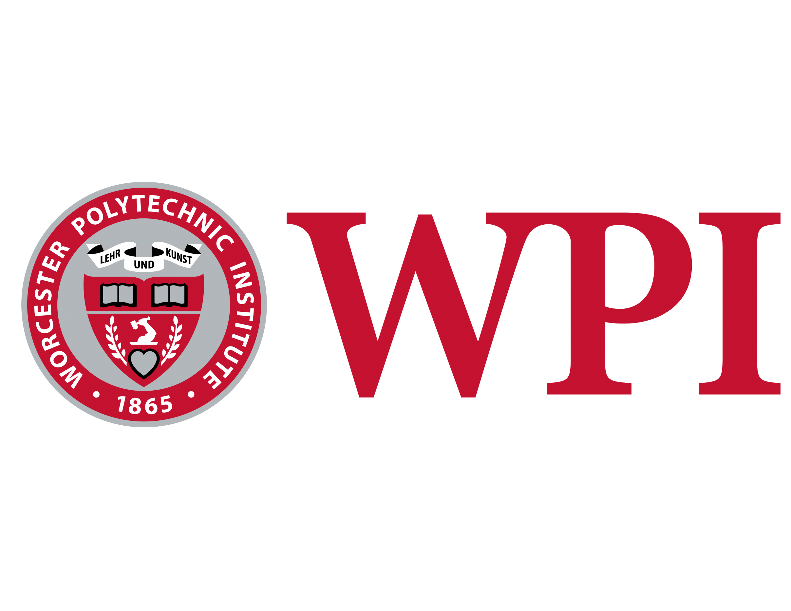

# Final Project Proposal 

**Submitted To:** Professor Lane Harrison and Course Staff

**Submitted By:** Alexander Antaya, Sydney Hurley, Jack Palmstrom, and Amanda Pennie

## Problem Statement
There currently aren’t any effective and efficient solutions for managing and analyzing small to medium-sized events. 

## Description
For our final project, we will be developing a web application that aims to help improve the management of events by 
providing users with a well-developed user experience, an event invitation distribution network, and data analytics. 
The problem is not that this technology doesn't exist; large-scale venues such as Fenway Park and Gillette Stadium use 
similar technology to manage their events. The main issue here is that this type of technology is out of reach for 
people coordinating small to medium-sized events due to cost and platform complexity. Keeping in mind our end user, we 
will develop our solution to be secure, scalable, and easy to use.

## Requirements
Features needed in the application in order to effectively solve the problem:
- Ability to sign-up and login to our platform. During this process, they will create a profile (Name, age, etc.). Once 
a user registers for an event, the manager of said event will be able to view the user's profile to ensure they are the 
person they meant to invite.
- Invitation Distribution Network
    - Give event coordinators an easy way to manage and track invitations being sent out.
    - Give event attendees the ability to view events they have already accepted an invitation for.
    - An easy way to distribute invitations. Either via a link or QR code.
- QR Code
    - Use a QR code system to track when attendees check-in/check-out of an event.
- Data Visualization / Analytics
    - Before an event:
        - Monitor the number of invitations that have been accepted
        - Who has accepted invitations (with the ability to search)
        - Be able to track who is giving out the invitations
            - Example: You are an event coordinator. You delegate the task of distributing invitations to the event to 
            three interns. It would be helpful to be able to see who is giving out the most invitations.
        - Dynamically adjust the number of invitations that can be accepted for an event.
        - Blacklist people from your event.
    - During the event:
        - How many people are currently at the event
    - After the event (viewing previous events):
        - Show a distribution over time of when people came/left to the event.
        - Average time people came/left the event.
        - Demographic distribution of people going to the event.
        - Peak attendance (what was the highest number of people at the event at the same time...and when was this)
- Give an event manager the ability to add support staff to an event. These people may have privilege restrictions for 
editing the event (meaning, an event assistant might not have the permissions to be able to delete the event or increase 
an invitation acceptance capacity).
- Give an event manager the ability to limit the number of invitations that an individual person can distribute.
- Security to protect user’s data.       
